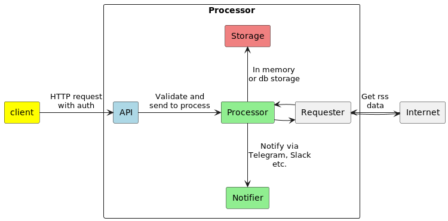
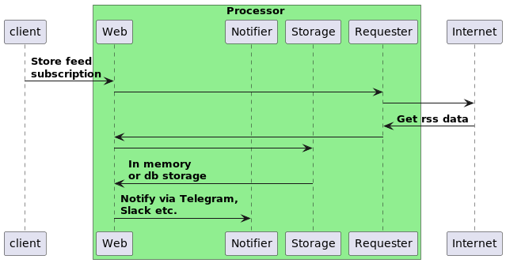

:toc: auto
:stylesheet: spring.css
:doctype: book
:toc-title: Table of content
toc::[]

= RSS aggregation application

== Description

A simple application to handle multiple RSS feeds and send notifications over predefined channels.

== Architecture

Module architecture is illustrated on the following picture:

Common module flow is illustrated on the following image:
